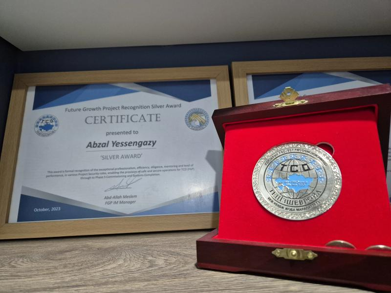
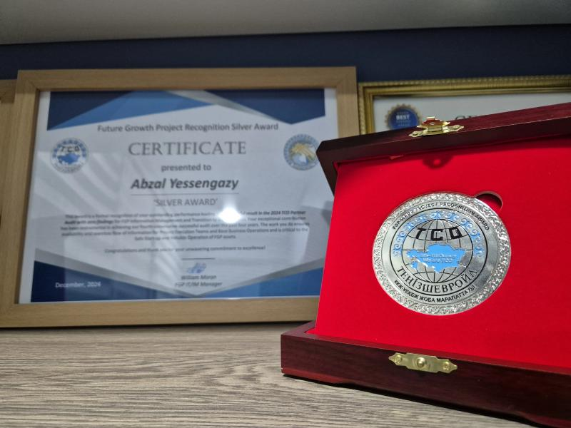

# Abzal Yessengazy  
**Atyrau, Kazakhstan**  
**Email**: abzal.yessengazy@gmail.com  
[LinkedIn: Abzal Yessengazy](https://www.linkedin.com/in/abzal-yessengazy/?locale=en_US)

---

## Professional Summary  
Data Enthusiast and Information Management Expert with a Master’s degree in Operational Research with Data Science. Skilled in managing teams, developing BI solutions, and ensuring asset data quality in the Oil & Gas industry. Proficient in SQL, Power BI, ETL, and machine learning, with a strong commitment to continuous improvement and achieving results.

---

## Experience  

### **Data Analytics Team Lead**  
*Information Management Group, Chevron Kazakhstan*  
**Jul 2024 – Present**  
- Managing a team of 36 data analysts, engineers, and document controllers for 1.8 million equipment tags and 60 million data points.  
- Developing strategic plans for timely, budget-compliant data delivery.  
- Implementing data quality assurance tools and procedures.  
- Supporting cross-functional teams with BI dashboards using SQL, Azure Data Factory, and Power BI.  

### **Data Engineer**  
*Information Management Group, Chevron Kazakhstan*  
**Nov 2020 – Jul 2024**  
- Led a team to deliver high-quality asset data for a major Oil & Gas project.  
- Developed ETL procedures using SSIS, SQL, Azure Data Factory, and PowerShell.  
- Created Power BI reports to support critical decision-making.  
- Trained teams on data processes and documented workflows.  

### **Intern Data Scientist**  
*ExPretio Technologies, Montreal, Canada (Remote)*  
**Jun 2020 – Sep 2020**  
- Developed a machine-learning model for railway passenger demand forecasting.  
- Proposed a Multi-Task Learning Model using Deep Neural Networks.  
- Outperformed competitors in 5 of 12 cases.  

### **Data Analyst**  
*Operational Excellence Group, Chevron Kazakhstan*  
**Sep 2015 – Aug 2019**  
- Created automated log-books and forecasted usage data.  
- Developed and analyzed KPIs, producing management reports.  
- Conducted data analysis using Excel and presented findings in English and Russian.  

### **Reporting Specialist**  
*HSE Department, Chevron Kazakhstan*  
**Aug 2013 – Sep 2015**  
- Analyzed and reported on HSE data to improve safety performance.  
- Developed dashboards and provided actionable insights.  

---

## Education  

**Master’s Degree**  
*Operational Research with Data Science*  
The University of Edinburgh (2019 – 2020)  
- Advanced courses in statistics, analytics, and machine learning.  
- Proficient in R, SQL, and Python.  

**Bachelor’s Degree**  
*Automation and Controls*  
L.N. Gumilyov Eurasian National University (2009 – 2013)  

---

## Technical Skills  
- **Databases**: SQL, MS SSMS, SSIS Packages  
- **ETL**: Extract, Transform, Load processes  
- **Visualization**: Power BI  
- **Machine Learning**: TensorFlow, Keras
- **Version Control**: Git
- **Other**: Presentation and communication skills, problem-solving  

---

## Languages  
- **English**: Advanced (C1)  
- **Russian**: Second Native  
- **Kazakh**: Native  
- **Turkish**: Intermediate (B2)  

---

## Recognitions  

### **Awards**  
- Recognized for outstanding contributions to the Chevron Kazakhstan Information Management Group.  
- Recipient of two Silver Medals for excellence in data analytics and project delivery.

  
  

---
## Recommendations  
- **Craig Ginnett**: Crisis & Emergency Management Professional  
- **Abduvakhit Junussov**: Experienced Data Analyst  
- **Botagoz Mukatova**: Data Scientist

## Portfolio

## BI Report Demo: Hackathon Dashboard

<video controls width="800">
  <source src="Power BI Dashboard for Hackathon.mp4" type="video/mp4">
  
Your browser does not support HTML5 video. Download the video <a href="Power BI Dashboard for Hackathon.mp4">here</a>.

</video>

## Excel Trick for Data Wrangling by Me

<video controls width="800">
  <source src="ExcelTrick.mp4" type="video/mp4">
  
Your browser does not support HTML5 video. Download the video <a href="ExcelTrick.mp4">here</a>.

</video>

## Download My CV
[Download CV - Abzal Yessengazy.docx](CV%20-%20Abzal%20Yessengazy.docx)

